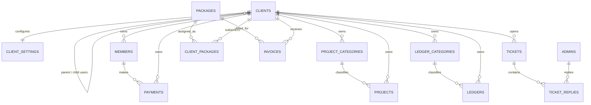

# eSmartDPS Database and Model Refactor

## 1. Project purpose

The codebase is a **multi-tenant cooperative savings / DPS management SaaS**.

A platform administrator manages SaaS packages, client organizations, invoices, global settings, administrators, and support. Each client organization can have an owner and child users, and manages its own members, share configuration, recurring member payments, investment projects, income/expense ledgers, settings, tickets, and activity history. Members have a separate login and can submit payment evidence.

### Main business areas

| Area | Responsibility |
|---|---|
| Platform administration | Admin users, packages, clients, global settings, invoices, permissions |
| Organization tenancy | Parent client account, child users, tenant settings and limits |
| Member savings | Members, shares, balances, monthly dues and payment proof |
| Investments | Project categories, projects, expected returns and project lifecycle |
| Accounting | Ledger categories, income/expense entries and reports |
| SaaS billing | Packages, trials, subscriptions and subscription invoices |
| Support and audit | Tickets, replies, activities and OTP records |

## 2. Core entity map



Polymorphic tables:

- `activities.causer_type/causer_id` supports administrators and client users.
- `otp_codes.userable_type/userable_id` supports OTP records for authenticatable models.

## 3. Major defects found and corrected

### Model defects

- Corrected relationships that referenced the nonexistent `App\Models\Client` class. The authoritative model is `App\Domain\Clients\Models\Client`.
- Added missing `$fillable` definitions to `ClientPackage` and missing member fields such as `password`, `profile_photo`, `share_quantity`, and `total_balance`.
- Corrected `Member` authentication to use the database `password` column instead of the nonexistent `pin` field.
- Added enum/date/boolean/array casts consistently.
- Added typed Eloquent relationship return types and reusable tenant/status scopes.
- Added complete `TicketReply` relationships and fillable fields.
- Added a compatibility accessor/mutator for the old payment `reference` name while standardizing storage as `reference_number`.
- Project duration is now calculated from `start_date` and `end_date`; stale duplicated duration data is no longer stored.
- Package/client subscription relationships now represent the real many-to-many association through `client_packages`.
- Active subscription and package-limit checks now require a non-expired active subscription.

### Migration defects

- Corrected migration/model column disagreements for payments, projects, settings, tickets, subscriptions, and invoices.
- Fixed the `ticket_reaplies` rollback typo.
- Added foreign keys with deliberate delete behavior.
- Added tenant-aware uniqueness, for example category name/slug uniqueness per client rather than globally.
- Added one-to-one uniqueness for `client_settings.client_id`.
- Added composite indexes for common tenant, status, date, category, member, and billing-period filters.
- Standardized enum storage widths and identifier lengths.
- Added invoice `due_date`, immutable package snapshots, and a unique subscription billing-period constraint.
- Package deletion no longer destroys invoice history: invoice `package_id` is nullable with `nullOnDelete`, while package name/description remain as historical snapshots.

### Application compatibility defects

Schema changes were also aligned with the code paths that write to the tables:

- Consolidated invoice creation into `App\Domain\Invoices\Actions\CreateInvoiceAction`.
- Fixed invoice commands/controllers/seeders that wrote nonexistent `amount` or `due_date` fields while omitting required billing/package fields.
- Replaced the nonexistent `packages.duration_days` dependency with billing-cycle date calculation.
- Synchronized subscription `status` and `is_active` when subscriptions are replaced or expire.
- Prevented repeated payment approval from increasing a member balance multiple times; paid-status reversals now adjust the balance transactionally.
- Standardized all monetary database values as **whole currency units** (for example, BDT), not a mix of whole units and cents.
- Restricted client activity lists to the current organization and its child users, fixing a cross-tenant data exposure risk.
- Removed duplicate `copy` and `backup` PHP/route/view files from the production tree.

### Credential security

Hard-coded bKash, SSLCommerz, SMS, and mail credentials were removed from controllers, seeders, and config defaults. Credentials now resolve from admin settings or environment variables. The output package does not include the uploaded `.env` file.

## 4. Schema conventions after refactor

1. **Tenant ownership:** organization-owned records use `client_id` and tenant-scoped validation/query scopes.
2. **Money:** unsigned integers represent whole currency units consistently.
3. **Status values:** backed PHP enums are used wherever a domain enum already exists.
4. **Historical billing:** invoice package snapshots remain immutable even if package details later change.
5. **Derived data:** project duration/progress are calculated, not duplicated in columns.
6. **Deletion:** child operational data cascades where appropriate; billing/package history is protected or detached.
7. **Indexing:** composite indexes begin with the tenant/owner key for the most frequent application filters.
8. **Mass assignment:** model fillables align with migration columns; virtual aliases are documented.

## 5. Important deployment note

The historical migration files were normalized so a **new installation** builds the corrected schema directly.

For an existing production database, do **not** run `php artisan migrate:fresh`. Replacing already-executed migration files does not update a live database. Create and test a forward-only upgrade migration against a backup of the actual production schema and data. Column renames, duplicate cleanup, tenant uniqueness, and invoice backfilling must be handled according to the live data.

Recommended fresh-development commands:

```bash
cp .env.example .env
composer install
php artisan key:generate
php artisan migrate:fresh --seed
npm install
npm run build
```

## 6. Validation performed

- PHP syntax lint completed successfully for **269 PHP files**.
- All **17 refactored models** instantiated successfully after Laravel bootstrap.
- Static model-write audit checked **29** array-based model write calls with no unknown fillable keys.
- Static direct-query audit checked **79** model column calls with no unknown columns.
- Laravel successfully generated the application route list containing **187 routes**.
- The modified admin invoice Blade view compiled and its generated PHP passed syntax validation.

A real database migration could not be executed in the analysis environment because PHP has base PDO but no PDO MySQL/SQLite driver. Laravel Pint and the normal console view-cache command also could not run because the environment lacks `mbstring`, XML/DOM extensions. These are environment limitations, not claimed test passes.

## 7. Recommended next improvements

- Add forward upgrade migrations after inspecting the actual deployed database.
- Encrypt gateway/API/mail secrets at rest with encrypted casts or a dedicated secrets service.
- Add soft deletes and immutable audit events for invoices, payments, ledgers, and subscriptions if regulatory history matters.
- Move balance mutation and invoice/subscription lifecycle logic into dedicated domain services with automated integration tests.
- Add database-level check constraints where the production database supports them, especially for amounts, dates, and mutually exclusive ticket-reply authors.
- Replace globally sequential human IDs with tenant-aware sequences or UUID/ULID identifiers if write volume grows significantly.
